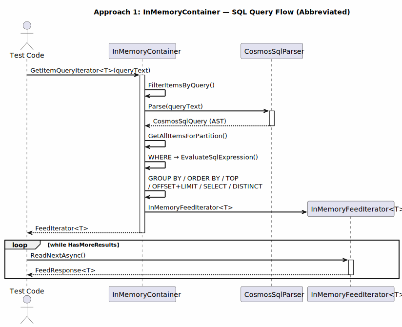
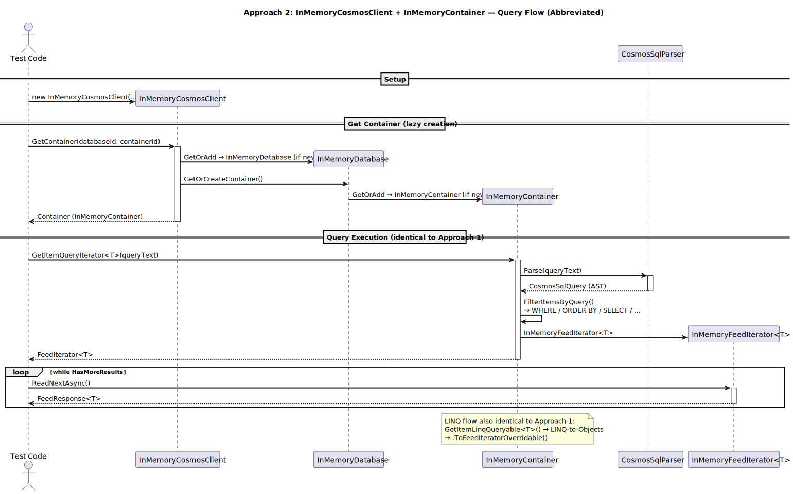
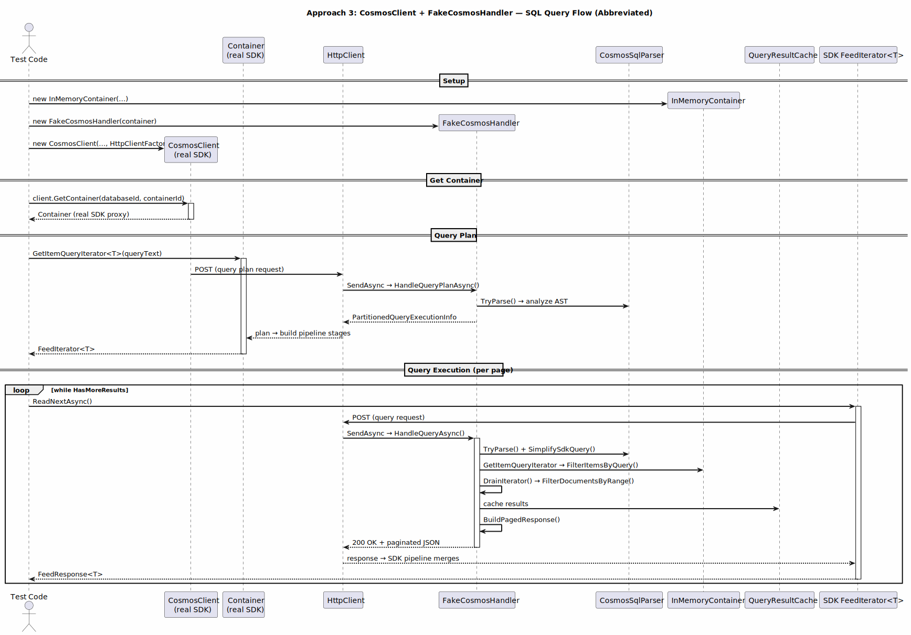
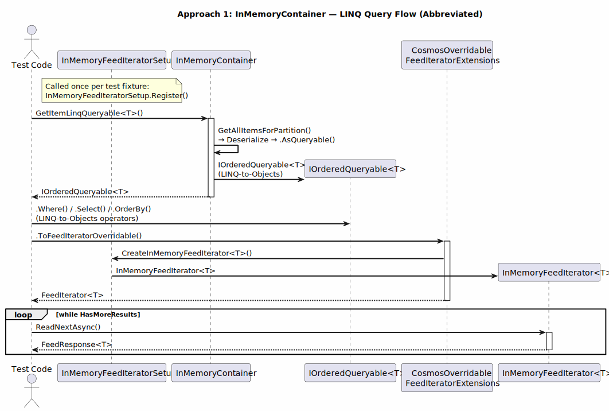
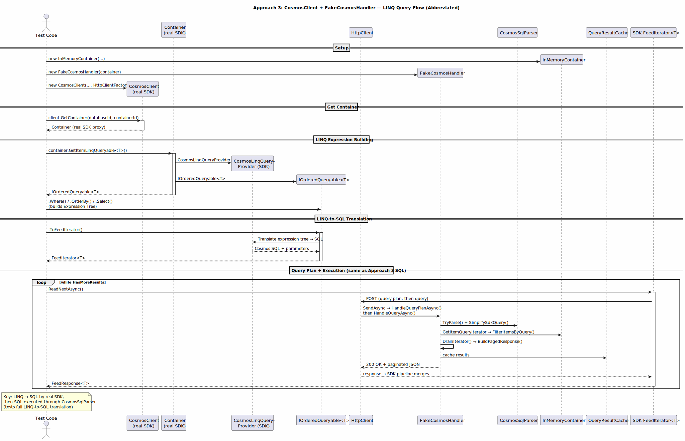
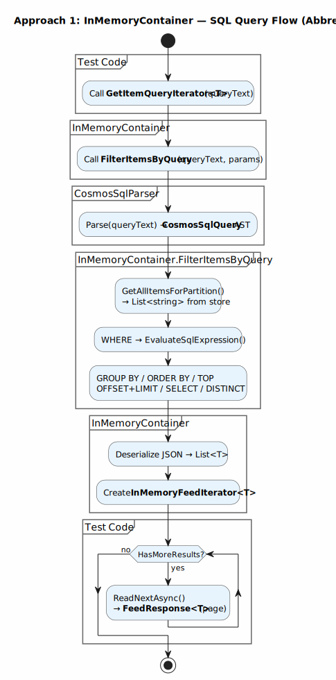
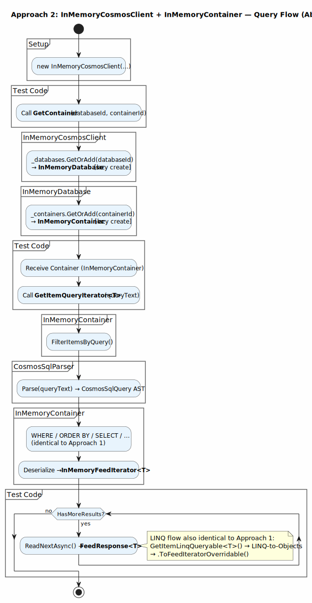
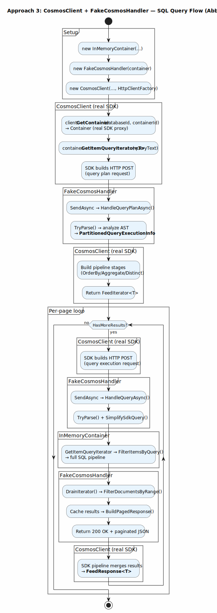
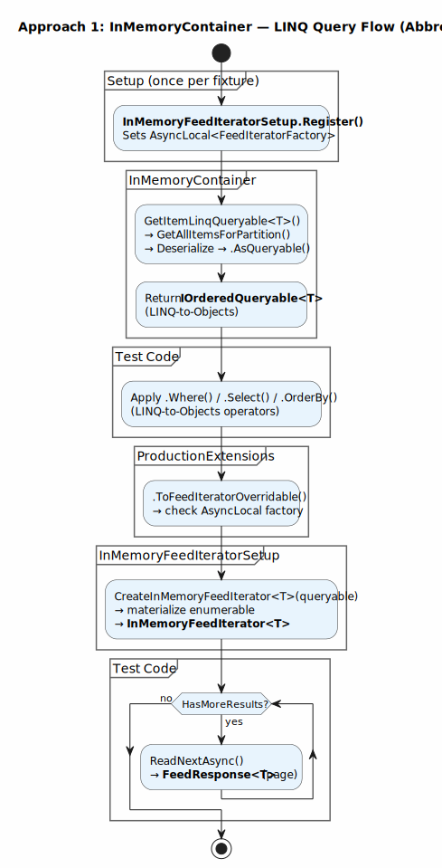
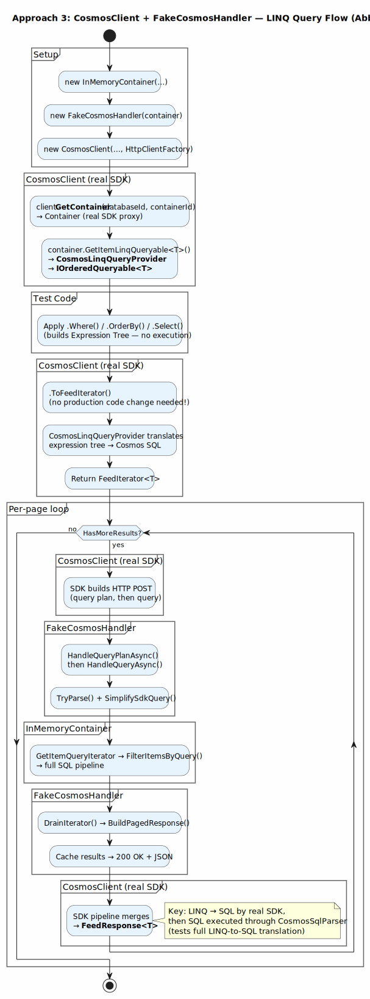

# Query Flow Comparison — Integration Approaches

This page compares the query execution flow across the three integration approaches described in [Integration Approaches](https://github.com/lemonlion/CosmosDB.InMemoryEmulator/wiki/Integration-Approaches). SQL queries are shown first (simpler pattern), then LINQ queries.

> **Approach 1** (InMemoryContainer) is included standalone — Approaches 2 and 3 are shown side-by-side for comparison since they both involve a `CosmosClient`.

---

## Sequence Diagrams

### SQL Query Flow

#### Approach 1: InMemoryContainer (standalone)

#### Approach 2 vs Approach 3 — SQL (side-by-side)

<table>
<tr>
<th>Approach 2: InMemoryCosmosClient + InMemoryContainer</th>
<th>Approach 3: CosmosClient + FakeCosmosHandler</th>
</tr>
<tr>
<td></td>
<td></td>
</tr>
</table>

### LINQ Query Flow

#### Approach 1: InMemoryContainer (standalone)

#### Approach 2 vs Approach 3 — LINQ (side-by-side)

<table>
<tr>
<th>Approach 2: InMemoryCosmosClient + InMemoryContainer</th>
<th>Approach 3: CosmosClient + FakeCosmosHandler</th>
</tr>
<tr>
<td>

Same as Approach 1 LINQ — `GetItemLinqQueryable<T>()` returns a **LINQ-to-Objects** `IOrderedQueryable<T>`, operators run as C# delegates, and `.ToFeedIteratorOverridable()` wraps results in `InMemoryFeedIterator<T>`. No SQL parsing involved.

</td>
<td></td>
</tr>
</table>

> **Key LINQ difference:** Approaches 1 & 2 execute LINQ as C# delegates (LINQ-to-Objects). Approach 3 uses the real SDK's `CosmosLinqQueryProvider` to translate the expression tree into Cosmos SQL, which then flows through `FakeCosmosHandler` → `CosmosSqlParser` → `InMemoryContainer.FilterItemsByQuery()` — testing the full LINQ-to-SQL translation pipeline.

---

## Activity Diagrams

### SQL Query Flow

#### Approach 1: InMemoryContainer (standalone)

#### Approach 2 vs Approach 3 — SQL (side-by-side)

<table>
<tr>
<th>Approach 2: InMemoryCosmosClient + InMemoryContainer</th>
<th>Approach 3: CosmosClient + FakeCosmosHandler</th>
</tr>
<tr>
<td></td>
<td></td>
</tr>
</table>

### LINQ Query Flow

#### Approach 1: InMemoryContainer (standalone)

#### Approach 2 vs Approach 3 — LINQ (side-by-side)

<table>
<tr>
<th>Approach 2: InMemoryCosmosClient + InMemoryContainer</th>
<th>Approach 3: CosmosClient + FakeCosmosHandler</th>
</tr>
<tr>
<td>

Same as Approach 1 LINQ — LINQ-to-Objects execution, no SQL parsing.

</td>
<td></td>
</tr>
</table>

---

## Summary

| | Approach 1 | Approach 2 | Approach 3 |
|---|---|---|---|
| **Entry point** | `InMemoryContainer` directly | `InMemoryCosmosClient.GetContainer()` → same | Real `CosmosClient` → HTTP → `FakeCosmosHandler` |
| **SQL parsing** | `CosmosSqlParser.Parse()` | Same | Same (inside handler) |
| **LINQ execution** | LINQ-to-Objects (C# delegates) | Same | **SDK translates LINQ → SQL → CosmosSqlParser** |
| **HTTP layer** | None | None | Real SDK HTTP pipeline intercepted |
| **Query plan** | None | None | `HandleQueryPlanAsync()` returns `PartitionedQueryExecutionInfo` |
| **Pagination** | Offset-based (`InMemoryFeedIterator`) | Same | Offset-based in HTTP headers + `QueryResultCache` |
| **Production changes** | `.ToFeedIteratorOverridable()` for LINQ | Same | **None** |

### Detailed Diagrams

For fully expanded versions showing every method call, expression evaluation, and HTTP header, see the [detailed](detailed/svg/) SVGs.
